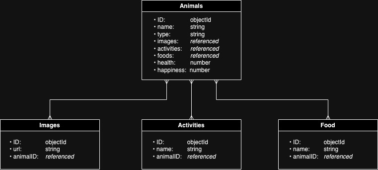
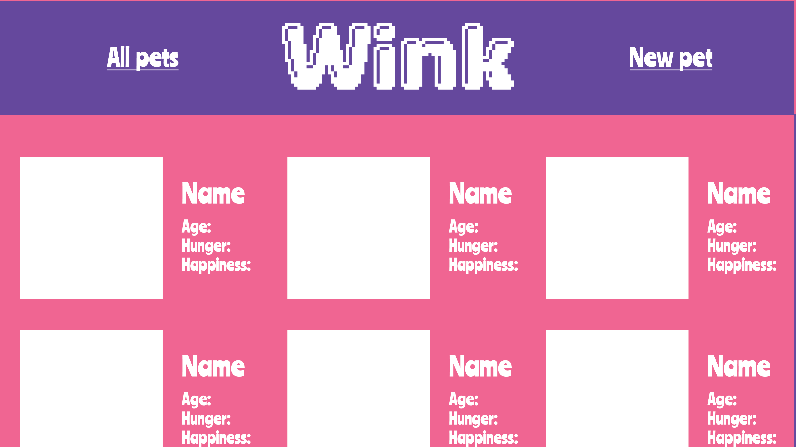
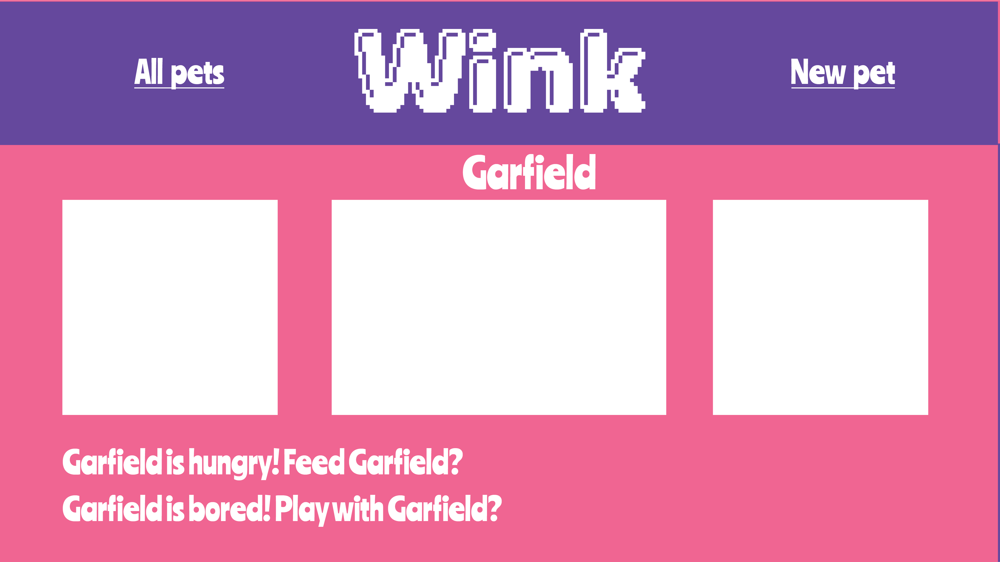
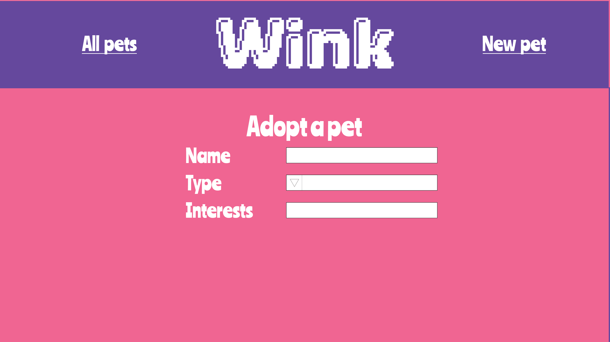

# Wink
Wink is a full-stack MERN application that allows users to create and interact with digital pets.

## Models
### Animal Model
| Property            | DataType          |
| ------------------- | ----------------- |
| _id                 | ObjectId          |
| name                | String            |
| type                | String            |
| Foods               | [Food Schema]     |
| Health              | Number            |
| timestamps          | true              |

### Food Model
| Property            | DataType        |
| ------------------- | --------------- |
| _id                 | ObjectId        |
| name                | String          |
| timestamps          | true            |

## User Stories
### MVP
**As a user, I want to:**
- choose an animal type
- name that animal
- see created animals
- select activities + foods for the animals
- feed + play with the animals
- see if the animals are hungry or bored
### Icebox
**As a user, I want to:**
- be able to log in with google
- view the pets I have created
- view the pets others have created

## ERD

## Links

## Wireframes

