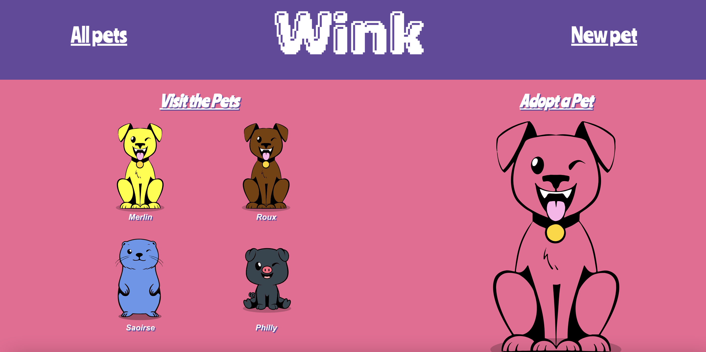
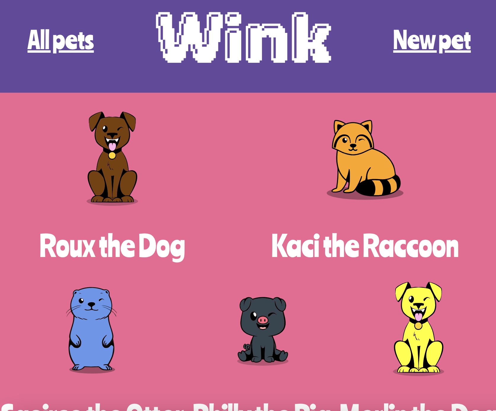
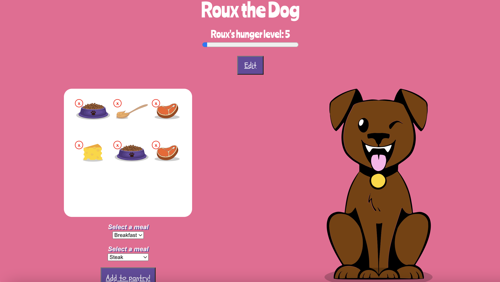
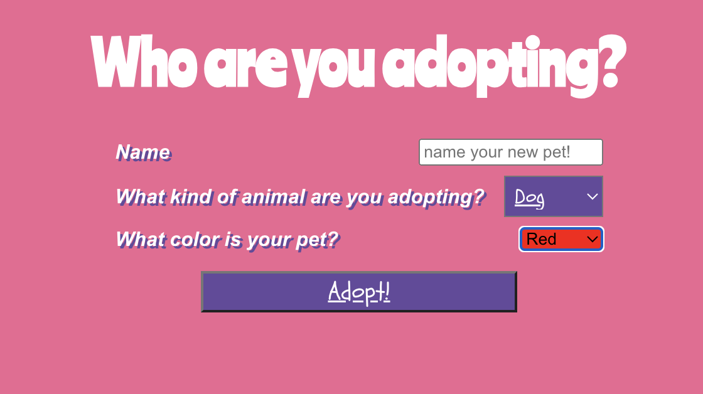
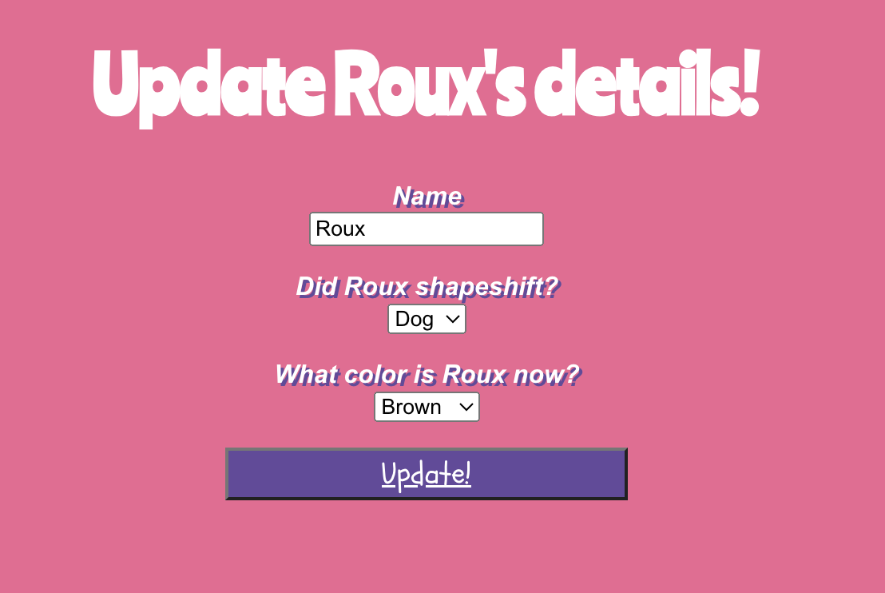

# Wink
Welcome to Wink, home of the cutest one-eyed animals you'll ever meet!
Wink is a full-stack MERN app that allows you to create and interact with digital pets.

Inspired by [Tamagotchi](https://tamagotchi.com/) and my one-eyed dog Roux. ❤️

## Deployed Application
Wink is deployed on Netlify, find it [here](https://winkfriends.netlify.app/)!

## Screenshots
**Wink homepage:** features 4 random pets and a link to adopt a pet. **To come:** Pet of the Day

**All Pets:** features all pets that have been created.

**Individual Pet:** showcases an individual animal, including their image, hunger level, and available foods. **To come:** Username of pet creator, styling for hunger level, toys and happiness level.

**Create animal form:** create the animal you'd like to adopt - name it and choose the animal type and color. **To come:** Possible implementation of 3rd-party API to expand available animal options.

**Update animal form:** make changes to your animal. **To come:** Only the animal's creator can edit animal.

## Technologies Used
- Mongo DB
- Express.js
- [React](https://react.dev/)
- Node.js
- Heroku
- Netlify

## Known Issues
- App is not mobile-friendly
- Hunger level does not change if pet has not been fed for a day or more

## Future Features
- Implement user authentication: animals can only be fed and edited by their owners
- Add toys/activities and happiness level: users can add toys and play with their pet to adjust happiness level
- Add a "pet of the day" on homepage: feature a different pet every day
- Create animations: ex. the animal "eats" food when it is fed
- Hunger/happiness bar styling: the progress bar will change colors based on how hungry/happy the animal is
- Utilize a 3rd-party API for more flexibility in animal creation

## Resources and Inspiration
I used the following assets as the basis for the assets you see on Wink.
- Dog image [by Britt England](https://www.brittany-england.com/) 
- Kibble image [by studiogstock on Freepik](https://www.freepik.com/free-vector/mascots-bags-food-set_5141995.htm#query=kibble&position=4&from_view=search&track=sph)
- Cheese image [by brgfx on Freepik](https://www.freepik.com/free-vector/cheese-plate_32354323.htm#query=cheese&position=4&from_view=search&track=sph) 
- Pig image [by catalyststuff on Freepik](https://www.freepik.com/free-vector/cute-pig-sitting-cartoon-vector-icon-illustration-animal-nature-icon-concept-isolated-premium-flat_40513463.htm#query=cute%20pig%20cartoon&position=0&from_view=keyword&track=ais)
- Peanut butter image [by brgfx on Freepik](https://www.freepik.com/free-vector/peanut-butter-elements-icons-set_40367911.htm)
- [Glitter copyright text](https://www.glitter-graphics.com/graphics/602494)
I found a lot of general inspiration for creating a 90s-style website, and especially found this list to be helpful.
- [General design inspiration](https://www.creativebloq.com/news/retro-modern-websites)
